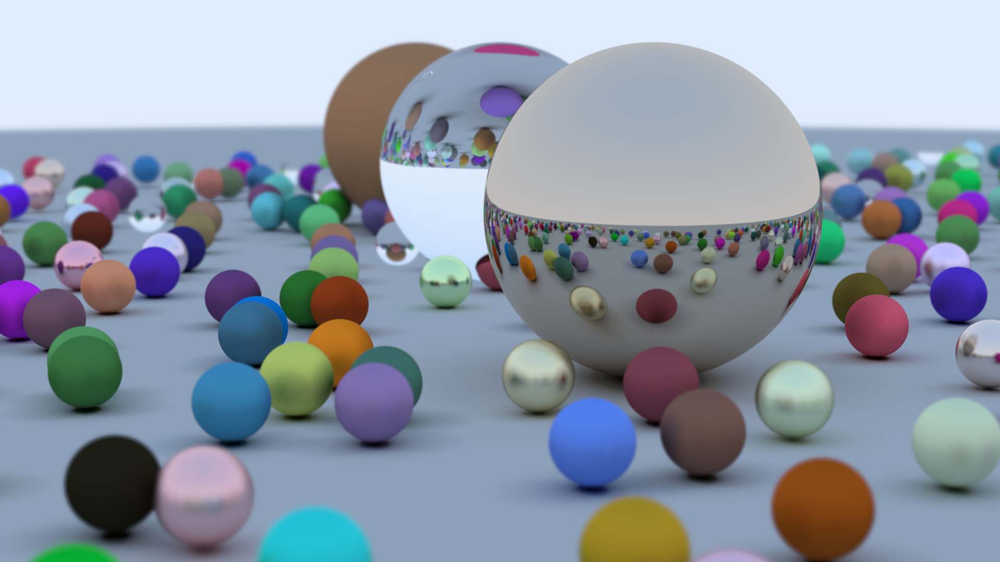

# rt-weekend-vk

Implementation of [Ray tracing in one weekend](https://raytracing.github.io/)
using Vulkan compute shaders.

Dependencies: [vulkan.hpp](https://github.com/KhronosGroup/Vulkan-Hpp),
[vk-bootstrap](https://github.com/charles-lunarg/vk-bootstrap),
[stb_image_write.h](https://github.com/nothings/stb).

Build & run scripts in `scripts/` is only included for convenience, it requires
[g++](https://gcc.gnu.org/) (C++ compiler),
[glslc](https://github.com/google/shaderc) (GLSL to SPIR-V compiler) and
[viu](https://github.com/atanunq/viu) (command-line image viewer), but other
tools work fine. Support for other tools are NOT provided, user with different
setups must tweak the scripts or run them manually.

## Usage

The Python module `data_gen` is used to generate render data. Render data
consists of a CPU part (width, height of the image) and a GPU part (geometric
data, materials). The generated data is stored in `render.dat`, in native format.

To generate the data, run:
```sh
# replace xx with the image number (10, 13, 16, etc.)
python -m data_gen.image_xx
```

This file is then loaded by the Vulkan application `main.cpp`. The GPU part is
directly uploaded to the GPU as-is, while CPU data is used for setting up the
graphics environment (image).

Since UBOs (uniform buffer ~~objects~~) has a minimum guaranteed size of 16
KiB, we will dynamically determine whether we should use UBOs or SSBOs (shader
storage buffer ~~objects~~) in `main.cpp` and `main.glsl`.

>Note: ~~objects~~ are strikethroughs since buffer object is only a concept
>from OpenGL, not Vulkan.

Building the application requires a C++20 compiler and some Vulkan libraries.
```sh
# generate output.hdr file
g++ main.cpp -lvulkan -lvk-bootstrap -std=c++20
# generate output.png file
g++ main.cpp -lvulkan -lvk-bootstrap -std=c++20 -DOUTPUT_PNG
```

Compiling the shader requires a GLSL-to-SPIR-V compiler that supports
`#include` directives.
```sh
glslc -fshader-stage=comp shaders/main.glsl -o shaders/main.spv -O -Werror
```

Finally, running the application generates an image file (`output.hdr` or
`output.png`).

## Final results

Here is the iconic image from the book, reproduced in 1080p, 500 samples per
pixel, with max ray tracing depth of 50. It renders in about 23 seconds on my
RTX 3060 Mobile.



Here is a comparison table between this implementation and [a direct CUDA
translation by Roger
Allen](https://developer.nvidia.com/blog/accelerated-ray-tracing-cuda/).
Additional results for CPU rendering is presented based on Roger Allen's
results: the original CPU time is measured on a 6-core i7 CPU, while the
interpolated time is calculated as: 
$$ 
    \text{InterpolatedCPU} = \text{OriginalCPU} \times \frac{\text{OurGPUTime}}{\text{AllenGPUTime}},
$$
which is an approximation of how fast the CPU renderer could be if run on my
system. The task is to render a 1200x800 image of the cover scene, 10 samples
per pixel, with a max ray tracing depth of 50.

| Implementation     | Time (seconds) |
| ------------------ | -------------- |
| **Vulkan**         | **0.267734**   |
| CUDA               | 1.63181        |
| CPU (interpolated) | 21.9198        |
| CPU (original)     | 90             |

